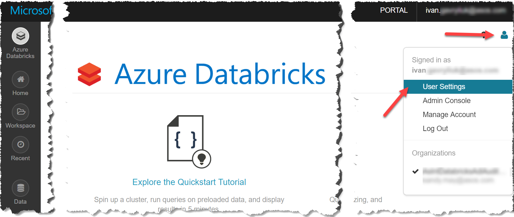
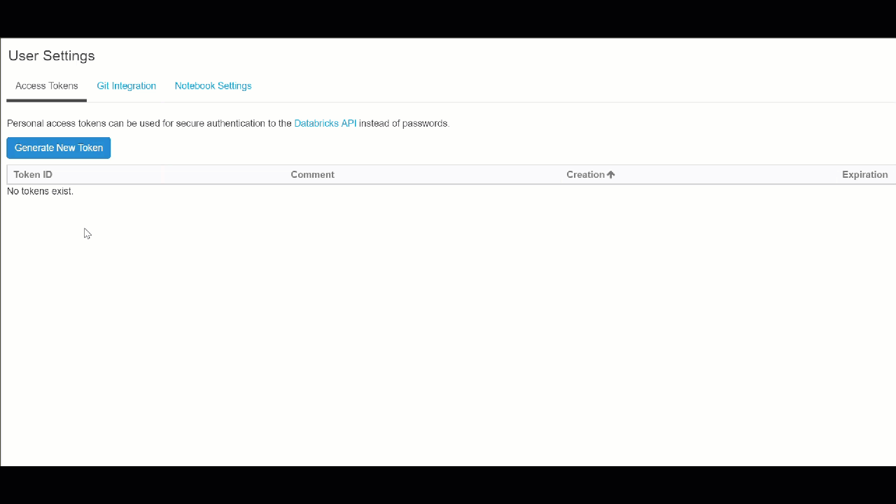

# DataBricks REST SDK for .NET

Unofficial .NET wrapper for for [DataBricks REST API](https://docs.azuredatabricks.net/api/index.html).

## Obtaining Authentication Token

On DataBricks portal go to *User -> User Settings*

Create new token and copy before closing the dialog:

